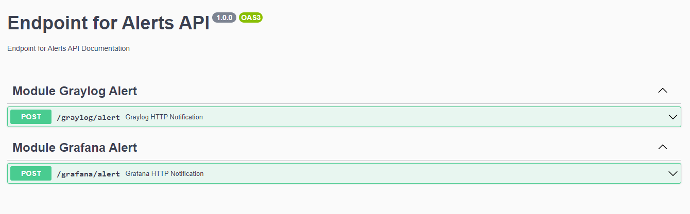

## End Point para Alertas via POST HTTP Notification

### Recebe os alertas do tipo HTTP Notification do Graylog e Grafana
#### A aplicação receberá nos endpoints abaixo o POST HTTP Notification enviado pelo Graylog e Grafana. Após tratar o objeto JSON, enviará um email utilizando as configurações setadas no arquivo <strong>.env</strong><br><br>

<br><br>

### <strong>BODY TEMPLATE GRAYLOG POST HTTP NOTIFICATION</strong>
```json
{
  "event_definition_id": "string",
  "event_definition_type": "string",
  "event_definition_title": "string",
  "event_definition_description": "string",
  "job_definition_id": "string",
  "job_trigger_id": "string",
  "event": {
    "id": "string",
    "event_definition_type": "string",
    "event_definition_id": "string",
    "origin_context": true,
    "timestamp": "2021-09-16T00:00:31.504Z",
    "timestamp_processing": "2021-09-16T00:00:31.504Z",
    "timerange_start": "2021-09-16T00:00:31.504Z",
    "timerange_end": "2021-09-16T00:00:31.504Z",
    "streams": [
      "string"
    ],
    "source_streams": [
      "string"
    ],
    "message": "string",
    "source": "string",
    "key_tuple": [
      "string"
    ],
    "key": "string",
    "priority": 0,
    "alert": true,
    "fields": {}
  },
  "backlog": [
    {
      "index": "string",
      "message": "string",
      "timestamp": "2021-09-16T00:00:31.504Z",
      "source": "198.51.100.42",
      "stream_ids": [
        "string"
      ],
      "fields": {
        "via_input": "string",
        "level": 0,
        "alert": "string",
        "gl2_remote_ip": "string",
        "gl2_remote_port": 0,
        "gl2_message_id": "string",
        "gl2_source_node": "3fa85f64-5717-4562-b3fc-2c963f66afa6",
        "gl2_source_input": "string",
        "extreme_timestamp": "2021-09-16",
        "facility": "string"
      },
      "id": "3fa85f64-5717-4562-b3fc-2c963f66afa6"
    }
  ]
}
```

### <strong>BODY TEMPLATE GRAFANA POST HTTP NOTIFICATION</strong>
```json
{
  "dashboardId": 0,
  "evalMatches": [
    {
      "value": 0,
      "metric": "string",
      "tags": {}
    }
  ],
  "imageUrl": "string",
  "message": "string",
  "orgId": 0,
  "panelId": 0,
  "ruleId": 0,
  "ruleName": "string",
  "ruleUrl": "string",
  "state": "string",
  "tags": {
    "tag name": "string"
  },
  "title": "string"
}
```

#### O envio de email da aplicação utiliza um servidor SMTP previamente configurado no arquivo <strong>.env</strong> na raiz do projeto, conforme abaixo<br><br>

```env
# SERVER CONFIG
PORT=3000

# Email
SMTP_SERVER=
SMTP_USER=
SMTP_PASS=
SMTP_PORT=587
SMTP_FROM=
SMTP_TO=
```
#### <strong>Observação: </strong><br>Em SMTP_TO, separe por vírgula, sem espaços, a lista de email que receberá os alertas como exemplo abaixo<br><br>
```env
SMTP_TO=email1@example.com,email2@example.com
```
<br>

```js
/**
 * Projeto: End Point for Alerts
 * Author: Jeferson Rodrigues
 * Email: jefersonr.santos@outlook.com
 * Created at: 2021-09-15
 * Updated at: 2021-09-15
 * 
 * Aplicação Backend Desenvolvida com Typescript
 */
```
